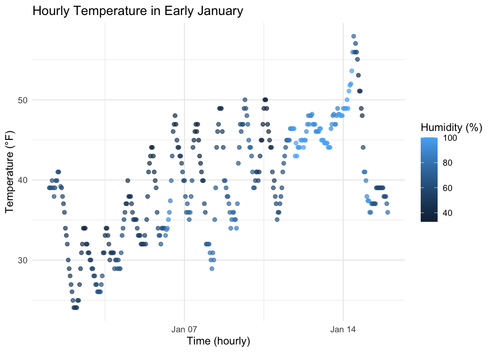

p8105_hw1_qs2301
================
2025-09-20

### Problem 1

``` r
data("early_january_weather")
```

``` r
library(dplyr)
data("early_january_weather")
var_names  <- names(early_january_weather)
var_names
```

    ##  [1] "origin"     "year"       "month"      "day"        "hour"      
    ##  [6] "temp"       "dewp"       "humid"      "wind_dir"   "wind_speed"
    ## [11] "wind_gust"  "precip"     "pressure"   "visib"      "time_hour"

``` r
n_obs      <- nrow(early_january_weather)
n_obs
```

    ## [1] 358

``` r
n_vars     <- ncol(early_january_weather)
n_vars
```

    ## [1] 15

``` r
mean_temp  <- mean(early_january_weather$temp, na.rm = TRUE)
mean_temp
```

    ## [1] 39.58212

``` r
origins    <- unique(early_january_weather$origin)
origins
```

    ## [1] "EWR"

``` r
time_rng   <- range(early_january_weather$time_hour, na.rm = TRUE)
time_rng
```

    ## [1] "2013-01-01 01:00:00 EST" "2013-01-15 23:00:00 EST"

### Short description

This dataset contains hourly weather observations from EWR between
2013-01-01 01:00 and 2013-01-15 23:00.  
It has **358 rows** and **15 columns**.  
Important variables include: - `origin` (airport code), `year`, `month`,
`day`, `hour` - `time_hour` (POSIXct date-time at the start of each
hour) - `temp` (air temperature, °F), `dewp` (dew point, °F), `humid`
(relative humidity, %) - `wind_dir` (degrees), `wind_speed` and
`wind_gust` (mph) - `precip` (inches), `pressure` (millibars), `visib`
(miles)

The **mean temperature** is **39.6 °F** (missing values removed). For
reference, the columns are: origin, year, month, day, hour, temp, dewp,
humid, wind_dir, wind_speed, wind_gust, precip, pressure, visib,
time_hour.

``` r
# scatterplot: temp vs time_hour, color by humidity
p <- ggplot(early_january_weather,
            aes(x = time_hour, y = temp, color = humid)) +
  geom_point(alpha = 0.7, size = 1.6) +
  labs(title = "Hourly Temperature in Early January",
       x = "Time (hourly)",
       y = "Temperature (°F)",
       color = "Humidity (%)") +
  theme_minimal()

# show plot in the knitted document
p
```

<!-- --> The scatterplot reveals a
repeating daily cycle of temperature changes. Colder times of day are
generally associated with higher humidity, whereas warmer periods show
lower humidity. This highlights the typical inverse relationship between
air temperature and relative humidity in early January at Newark.

### Problem 2

``` r
set.seed(100)
library(tidyverse)

df2 <- tibble(
  z    = rnorm(10),                              # numeric: N(0,1)
  pos  = z > 0,                                   # logical: TRUE if z > 0
  txt  = sample(c("red","green","blue","purple"), 10, replace = TRUE),  # character
  grp  = factor(sample(c("A","B","C"), 10, replace = TRUE))             # factor (3 levels)
)

df2
```

    ## # A tibble: 10 × 4
    ##          z pos   txt    grp  
    ##      <dbl> <lgl> <chr>  <fct>
    ##  1 -0.502  FALSE blue   B    
    ##  2  0.132  TRUE  purple C    
    ##  3 -0.0789 FALSE green  B    
    ##  4  0.887  TRUE  red    A    
    ##  5  0.117  TRUE  purple C    
    ##  6  0.319  TRUE  blue   C    
    ##  7 -0.582  FALSE blue   A    
    ##  8  0.715  TRUE  purple C    
    ##  9 -0.825  FALSE green  B    
    ## 10 -0.360  FALSE red    B

``` r
mean(df2 |> pull(z))      # works: numeric mean
```

    ## [1] -0.01795716

``` r
mean(df2 |> pull(pos))    # works: TRUE/FALSE coerces to 1/0 → share TRUE
```

    ## [1] 0.5

**Explanation:** - **Numeric (`z`)**: `mean()` returns the arithmetic
mean.  
- **Logical (`pos`)**: `TRUE`→1, `FALSE`→0 under the hood, so
`mean(pos)` is the **proportion of TRUEs** (the share of `z > 0`). -
**Character (`txt`)**: has no numeric meaning; `mean()` throws an
error. - **Factor (`grp`)**: also throws an error; factors are
categorical labels, not numbers.

``` r
as.numeric(df2$pos)  # logical → 0/1
```

    ##  [1] 0 1 0 1 1 1 0 1 0 0

``` r
as.numeric(df2$txt)  # character → NA (not coercible to numbers)
```

    ## Warning: NAs introduced by coercion

    ##  [1] NA NA NA NA NA NA NA NA NA NA

``` r
as.numeric(df2$grp)  # factor → underlying integer level codes (A=1, B=2, C=3)
```

    ##  [1] 2 3 2 1 3 3 1 3 2 2

**What happens & why:** - `as.numeric(logical)` returns **0/1**, which
is why `mean(pos)` works and equals the fraction of positives. -
`as.numeric(character)` returns **`NA`** with a warning (“NAs introduced
by coercion”) because strings like `"red"` can’t be turned into numbers;
hence you can’t take a meaningful mean. - `as.numeric(factor)` returns
the **internal integer codes of the levels** (e.g., A→1, B→2, C→3),
**not** meaningful measurements. A mean of these codes would be an
average of arbitrary labels.
